<p align="center">
  
</p>

<h1 align="center">Gridwolf</h1>

<p align="center">
  <strong>Passive ICS/SCADA Network Discovery, Vulnerability Intelligence & Security Assessment Platform</strong><br/>
  Full-Stack OT Security Tool with Real PCAP Processing, Protocol Dissection, Threat Detection & ICS Advisory Feed
</p>

<p align="center">
  
  
  
  
  
  
  
  
</p>

<p align="center">
  <a href="https://gridwolf.net">Website</a> &middot;
  <a href="DEPLOYMENT.md"><strong>📦 Deployment guide</strong></a> &middot;
  <a href="#screenshots">Screenshots</a> &middot;
  <a href="#option-1-docker-hub-recommended">🐳 Docker Hub</a> &middot;
  <a href="#option-2-ova-appliance">💿 OVA</a> &middot;
  <a href="#option-3-aws-marketplace">☁️ AWS</a> &middot;
  <a href="#option-4-azure-marketplace">🔷 Azure</a> &middot;
  <a href="#key-features">Features</a>
</p>

---

## What is Gridwolf?

Gridwolf is a **fully functional** passive ICS/SCADA network discovery and security assessment platform. It analyzes captured network traffic (PCAP files) to automatically identify industrial devices, map communication patterns, detect protocol anomalies, perform C2/beacon detection, match CVEs, and generate professional assessment reports — **without transmitting a single packet** to the monitored network.

Unlike tools that are just dashboards on top of mock data, Gridwolf has a **real processing backend** powered by Scapy, with deep packet inspection for 6 ICS protocols, a C2 beacon detection engine, NVD CVE integration, ICS vulnerability intelligence from 7 advisory sources, and PDF report generation.

> **Gridwolf never actively scans or probes the industrial network. All discovery is done by passive traffic analysis only.**

---

## Architecture

```
┌────────────────────────────────────────────────────────────────┐
│                    Frontend (React 19 + Vite)                  │
│  30+ Pages · Topology Graph · Protocol Analysis · Dark Theme   │
├────────────────────────────────────────────────────────────────┤
│                         REST API                               │
├────────────────────────────────────────────────────────────────┤
│                  Backend (FastAPI + Python)                     │
│  ┌──────────┐ ┌──────────────┐ ┌────────────┐ ┌────────────┐  │
│  │  PCAP    │ │  Protocol    │ │    C2      │ │   CVE      │  │
│  │Processor │ │  Parsers     │ │ Detector   │ │  Lookup    │  │
│  │ (Scapy)  │ │ (6 parsers)  │ │(IAT/DNS/  │ │(NVD API +  │  │
│  │          │ │              │ │ Asymmetric)│ │ Offline DB)│  │
│  └──────────┘ └──────────────┘ └────────────┘ └────────────┘  │
│  ┌──────────┐ ┌──────────────┐ ┌────────────┐                 │
│  │  Vuln    │ │   Device     │ │   Risk     │                 │
│  │  Feed    │ │ Classifier   │ │Assessment  │                 │
│  │(7 Source)│ │(Purdue/OUI)  │ │  Engine    │                 │
│  └──────────┘ └──────────────┘ └────────────┘                 │
│  ┌──────────┐                                                  │
│  │  Report  │                                                  │
│  │Generator │                                                  │
│  │(PDF/HTML)│                                                  │
│  └──────────┘                                                  │
├────────────────────────────────────────────────────────────────┤
│              SQLite Database (aiosqlite)                        │
│  17 Tables · Sessions · Devices · Connections · Findings       │
└────────────────────────────────────────────────────────────────┘
```

---

## Screenshots

### Login & Dashboard
| Login | Command Center |
|---|---|
| 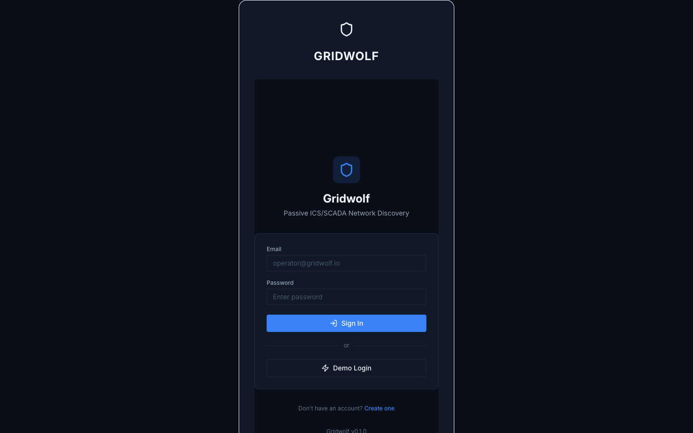 | 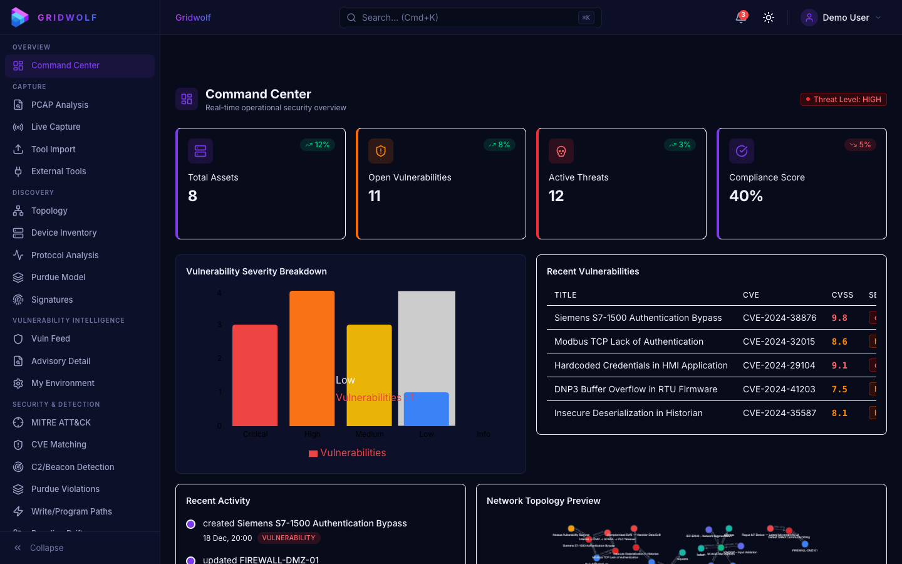 |

### Capture & Ingestion
| PCAP Analysis | Live Capture | External Tool Import |
|---|---|---|
| 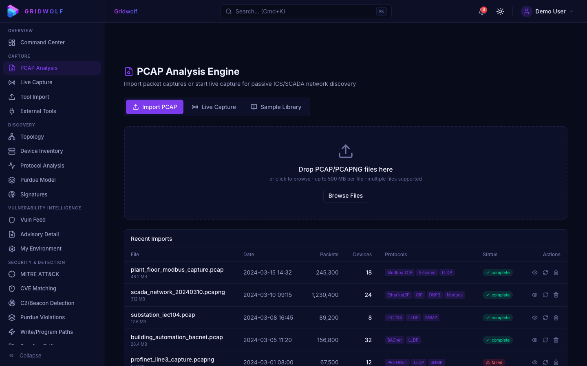 | 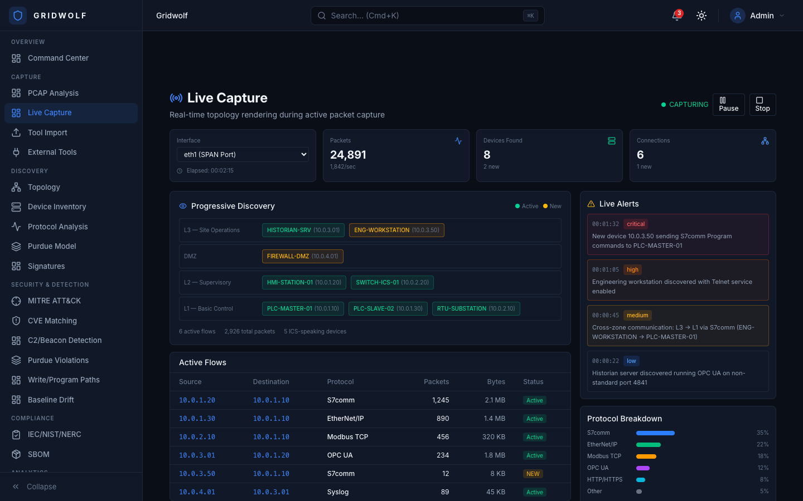 |  |

### Network Discovery
| Topology | Device Inventory | Protocol Analyzer |
|---|---|---|
| 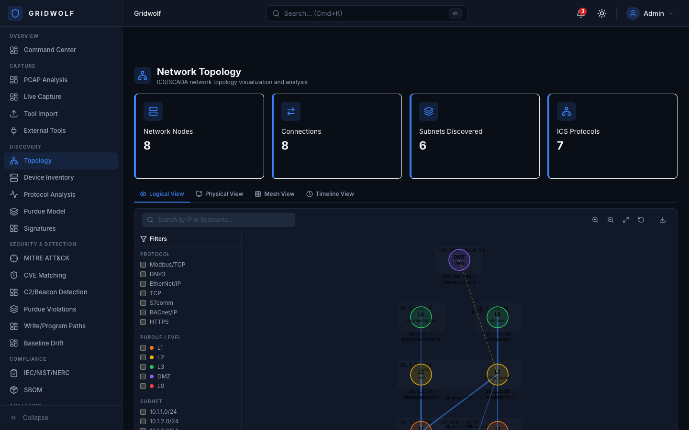 | 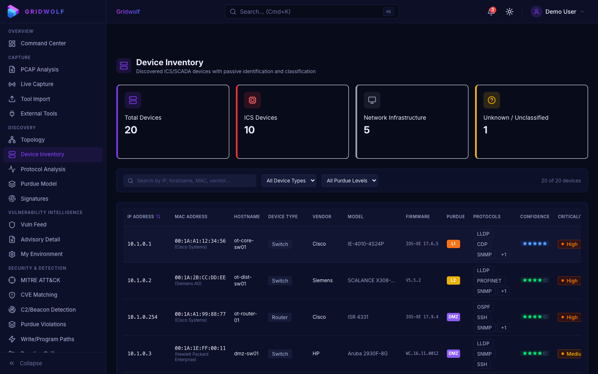 |  |

| Purdue Model | Signature Editor |
|---|---|
|  | 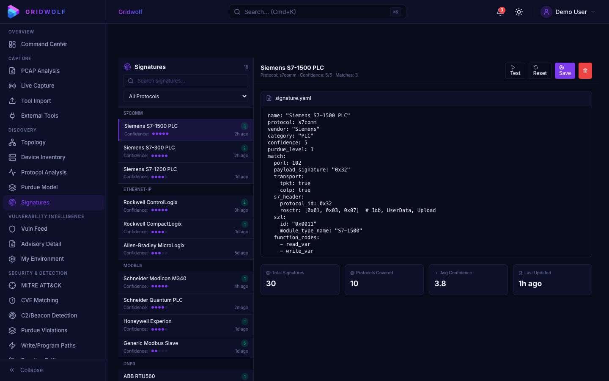 |

### Vulnerability Intelligence (NEW)
| ICS/OT Vuln Feed | My Environment |
|---|---|
|  | 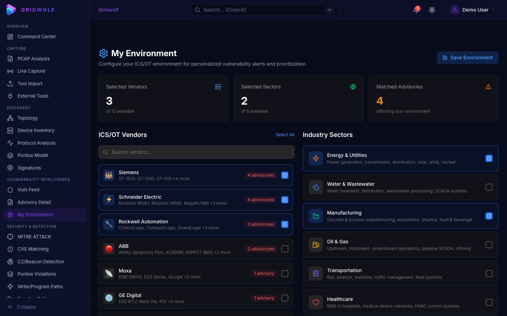 |

### Security & Detection
| MITRE ATT&CK for ICS | Vulnerability / CVE Matching |
|---|---|
| 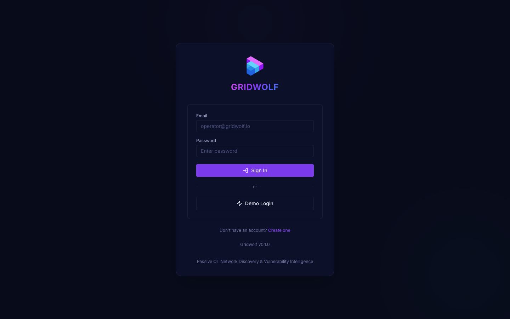 |  |

| C2 / Beacon Detection | Purdue Violations | Write/Program Paths |
|---|---|---|
|  |  |  |

| Baseline Drift | Compliance (IEC/NIST/NERC) |
|---|---|
| 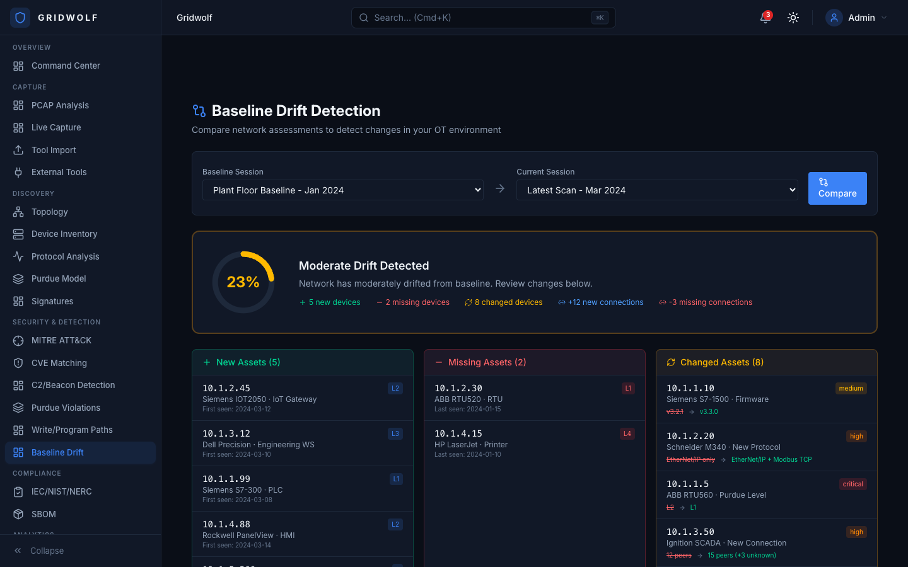 |  |

### Analytics & Metrics
| OT Metrics & Analytics | Security Scorecard | Timeline |
|---|---|---|
| 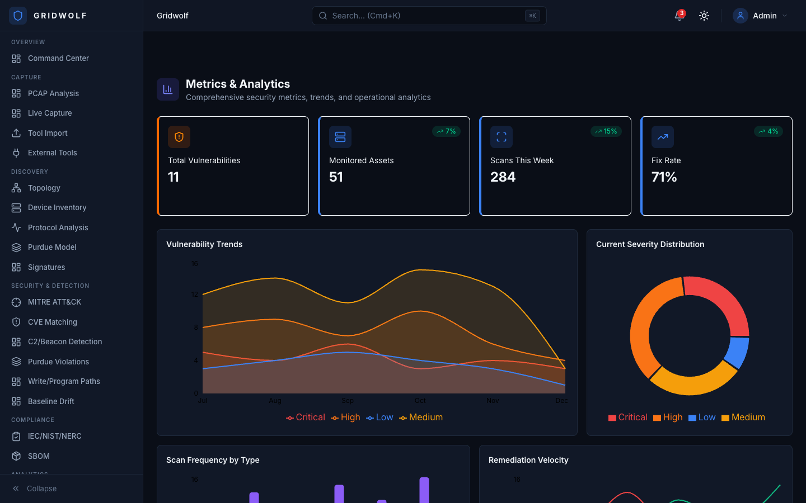 |  |  |

### Investigations
| Focus Queue | Report Diffing |
|---|---|
|  | 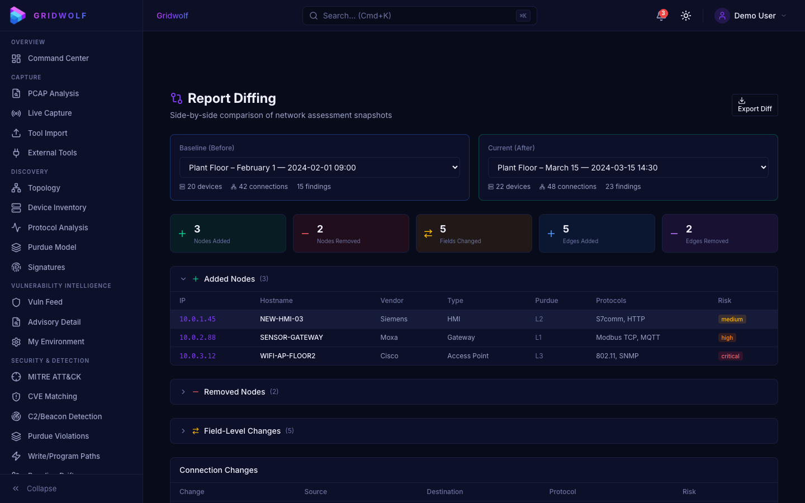 |

### Reporting & Administration
| Assessment Reports | SBOM | System Admin |
|---|---|---|
|  |  |  |

---

## Key Features

### Real PCAP Processing Engine (Not Mock Data)

Gridwolf includes a **fully functional backend** — not just a UI prototype. When you upload a PCAP file, the system:

1. **Ingests** — Streams packets via Scapy's `PcapReader` (handles large files efficiently)
2. **Dissects** — Deep packet inspection for 6 ICS protocols with function code analysis
3. **Classifies** — Assigns device types, Purdue levels, vendors (38 OUI prefixes)
4. **Detects** — Runs C2 beacon detection, Purdue violation checks, write path analysis
5. **Stores** — Persists all results in SQLite with 17 normalized tables

### ICS/OT Vulnerability Intelligence Feed

Real-time advisory aggregation from **7 OT-specific sources** with CVSS v3.1 + CISA KEV + EPSS enrichment:

| Source | Coverage |
|---|---|
| **CISA ICS-CERT** | All ICS advisories |
| **Siemens ProductCERT** | SIMATIC, SCALANCE, SINEMA |
| **Schneider Electric** | Modicon, EcoStruxure, Magelis |
| **Rockwell Automation** | ControlLogix, CompactLogix, FactoryTalk |
| **ABB** | Ability, Symphony, ASPECT |
| **Moxa** | EDR, EDS Series, ioLogik |
| **CERT@VDE** | German industrial automation |

**Features:**
- 4-tier urgency classification: **Act Now** / **Plan Patch** / **Monitor** / **Low Risk**
- Environment personalization — select your vendors and sectors for matched alerts
- EPSS probability scoring for exploit likelihood
- CISA KEV flagging for known exploited vulnerabilities
- CSV export for compliance reporting

### ICS Protocol Deep Packet Inspection

| Protocol | Port | What Gridwolf Extracts |
|---|---|---|
| **Modbus TCP** | 502 | MBAP header, function codes (FC 1-43), register addresses, write detection, master/slave identification |
| **S7comm (Siemens)** | 102 | TPKT/COTP/S7 header parsing, job types (0x01-0x07), program upload/download flagging |
| **EtherNet/IP / CIP** | 44818 | Encapsulation header, CIP service codes, tag read/write operations |
| **DNP3** | 20000 | DLL + transport + application layer, master/outstation detection, object group parsing |
| **BACnet** | 47808 | BVLC/NPDU/APDU parsing, service identification, I-Am/Who-Is discovery |
| **IEC 60870-5-104** | 2404 | APDU type detection (I/S/U format), type ID parsing, cause of transmission |

### C2 / Beacon Detection Engine

Three independent detection methods run on every session:

- **IAT Histogram Analysis** — Detects periodic beaconing by analyzing inter-arrival time distributions. Uses coefficient of variation threshold (<0.15) with ICS polling exclusion to reduce false positives
- **DNS Exfiltration Detection** — Shannon entropy analysis per DNS subdomain label. Flags labels with entropy >4.0 (typical of base64/hex encoded data tunneling)
- **Asymmetric Flow Analysis** — Identifies suspicious data transfers with TX:RX ratio >20:1 and total volume >100KB

### CVE Vulnerability Matching

- **Offline ICS CVE Database** — 12 pre-loaded real OT CVEs (Siemens, Schneider Electric, Rockwell Automation, ABB, Fortinet, Moxa)
- **NVD API v2.0 Integration** — Live search against NIST National Vulnerability Database with optional API key
- **Device Matching** — Fuzzy matches discovered device vendors/firmware against known CVEs

### Professional Report Generation

- **PDF Reports** — WeasyPrint-powered professional assessment reports with cover page, executive summary, device tables, protocol analysis, findings, and recommendations
- **HTML Fallback** — Complete HTML report when WeasyPrint is not installed
- **Report Sections** — Executive Summary, Device Inventory, Protocol Analysis, Security Findings, Recommendations

### Network Topology & Device Classification

- **Purdue Model Assignment** — Automatic L0-L5 + DMZ classification based on protocol behavior
- **Device Type Detection** — PLC, HMI, Engineering Workstation, Historian, RTU, IED, Gateway
- **Vendor Identification** — 38 OUI MAC address prefixes covering Siemens, ABB, Rockwell, Schneider, Moxa, Beckhoff, Phoenix Contact, and more
- **Confidence Scoring** — 5-level scoring (port-only → deep parse)

### Security Assessment

- **MITRE ATT&CK for ICS** — 40+ detection rules mapped to techniques
- **Purdue Violation Detection** — Automated cross-zone communication anomaly detection
- **Write/Program Path Detection** — Flags dangerous Modbus writes, S7 program uploads, CIP tag writes
- **Default Credential Detection** — Checks for common ICS default passwords
- **Baseline Drift** — Quantified drift score between assessment sessions

### 50+ REST API Endpoints

| Category | Endpoints | Description |
|---|---|---|
| **Auth** | 3 | Register, login, profile |
| **PCAP** | 3 | Upload, status, list |
| **Devices** | 4 | List, topology, stats, detail |
| **Sessions** | 6 | CRUD + projects |
| **Findings** | 4 | List, stats, status update |
| **CVE** | 2 | Search NVD, match devices |
| **Vuln Feed** | 10 | Advisories, stats, sources, export, environment config |
| **Reports** | 3 | Generate, download, list |
| **Ontology** | 4 | Types, graph, CRUD |
| **Dashboard** | 3 | Stats, saved dashboards |
| **Scanners** | 4 | Semgrep, Trivy, SARIF, generic import |

---

## Installation

Choose the deployment method that fits your environment:

| Method | Best for | Time to running |
|---|---|---|
| [🐳 Docker Hub](#option-1-docker-hub-recommended) | Quick eval, self-hosted | ~2 min |
| [💿 OVA Appliance](#option-2-ova-appliance) | Air-gapped OT networks, VMware/VirtualBox | ~5 min |
| [☁️ AWS Marketplace](#option-3-aws-marketplace) | Cloud-hosted, EC2 | ~5 min |
| [🔷 Azure Marketplace](#option-4-azure-marketplace) | Cloud-hosted, Azure VM | ~5 min |
| [🔧 Source / Dev](#option-5-source--developer-setup) | Development, customisation | ~10 min |

---

### Option 1: Docker Hub (Recommended)

No source code required. Pull pre-built images and start with two commands.

```bash
# 1. Download the compose file and config template
curl -O https://raw.githubusercontent.com/valinorintelligence/Gridwolf/main/docker-compose.hub.yml
curl -O https://raw.githubusercontent.com/valinorintelligence/Gridwolf/main/.env.example
cp .env.example .env
```

```bash
# 2. Set two required secrets in .env
#    Generate SECRET_KEY:
python3 -c "import secrets; print(secrets.token_urlsafe(64))"
#    Generate POSTGRES_PASSWORD:
openssl rand -hex 32
# → paste both into .env
```

```bash
# 3. Start
docker compose -f docker-compose.hub.yml up -d

# → Open http://localhost
# → API docs: http://localhost/api/docs
```

The admin password is printed to the backend log on first boot:
```bash
docker compose -f docker-compose.hub.yml logs backend | grep -A1 "Password"
```

**Stop / update:**
```bash
docker compose -f docker-compose.hub.yml down          # stop
docker compose -f docker-compose.hub.yml pull          # update to latest
docker compose -f docker-compose.hub.yml up -d         # restart
```

---

### Option 2: OVA Appliance

Purpose-built for **air-gapped OT environments**. All Docker images are pre-loaded — no internet access needed after deployment.

**Download:** Grab `gridwolf-<version>-amd64.ova.gz` from the [latest release](https://github.com/valinorintelligence/Gridwolf/releases/latest).

**Import into VMware ESXi / Workstation / VirtualBox:**
```
File → Import Appliance → select gridwolf-<version>-amd64.ova
Recommended: 2 vCPU · 4 GB RAM · 20 GB disk
```

**First-boot wizard** runs automatically on the console:
1. Confirms the VM's IP address
2. Prompts for an admin password (min 12 chars)
3. Generates all secrets automatically
4. Starts Gridwolf and prints the URL

**Minimum requirements:** 2 vCPU · 4 GB RAM · 20 GB storage

**Build your own OVA** (requires Packer + VirtualBox):
```bash
export GRIDWOLF_VERSION=v1.1.0
packer init packer/
packer build -var "gridwolf_version=$GRIDWOLF_VERSION" packer/gridwolf.pkr.hcl
# → output/gridwolf-v1.1.0-amd64.ova
# Production builds use deploy/ova/packer/ via .github/workflows/build-ova.yml
```

---

### Option 3: AWS Marketplace

One-click deploy via CloudFormation. Gridwolf runs on a single EC2 instance with an encrypted EBS data volume.

**From AWS Console:**
1. Open [CloudFormation → Create Stack → With new resources](https://console.aws.amazon.com/cloudformation/home#/stacks/create)
2. Upload `deploy/aws/gridwolf.template.yaml`
3. Fill in: `KeyPairName`, `InstanceType` (default `t3.large`), `GridwolfVersion`
4. Deploy — done in ~5 minutes

**Via AWS CLI:**
```bash
aws cloudformation create-stack \
  --stack-name gridwolf \
  --template-body file://deploy/aws/gridwolf.template.yaml \
  --parameters \
    ParameterKey=KeyPairName,ParameterValue=<your-key-pair> \
    ParameterKey=InstanceType,ParameterValue=t3.large \
    ParameterKey=GridwolfVersion,ParameterValue=latest \
  --capabilities CAPABILITY_IAM

# Get the URL when complete:
aws cloudformation describe-stacks --stack-name gridwolf \
  --query 'Stacks[0].Outputs'
```

**Recommended instance sizes:**

| Workload | Instance | vCPU | RAM |
|---|---|---|---|
| Evaluation | t3.medium | 2 | 4 GB |
| Standard | t3.large | 2 | 8 GB |
| Heavy PCAP | c5.2xlarge | 8 | 16 GB |

The admin password is in the EC2 instance system log (first boot only):
```bash
aws ec2 get-console-output --instance-id <id> --query Output --output text | grep -A1 Password
```

---

### Option 4: Azure Marketplace

Deploy to an Azure VM using Bicep (ARM template).

```bash
# Create resource group
az group create --name gridwolf-rg --location eastus

# Deploy
az deployment group create \
  --resource-group gridwolf-rg \
  --template-file deploy/azure/gridwolf.bicep \
  --parameters \
    adminPasswordOrKey="$(cat ~/.ssh/id_rsa.pub)" \
    authenticationType=sshPublicKey \
    vmSize=Standard_D2s_v3 \
    gridwolfVersion=latest

# Get the public URL
az deployment group show \
  --resource-group gridwolf-rg \
  --name gridwolf \
  --query properties.outputs
```

The admin password is in the VM boot diagnostics on first run:
```bash
az vm boot-diagnostics get-boot-log --resource-group gridwolf-rg --name gridwolf-vm \
  | grep -A1 Password
```

**Recommended VM sizes:**

| Workload | VM Size | vCPU | RAM |
|---|---|---|---|
| Evaluation | Standard_B2s | 2 | 4 GB |
| Standard | Standard_D2s_v3 | 2 | 8 GB |
| Heavy PCAP | Standard_F4s_v2 | 4 | 8 GB |

---

### Option 5: Source / Developer Setup

```bash
# 1. Clone
git clone https://github.com/valinorintelligence/Gridwolf.git
cd Gridwolf

# 2. Backend
cd backend
pip install -e ".[dev]"
cp ../.env.example .env    # set GRIDWOLF_SECRET_KEY + GRIDWOLF_DEBUG=true
uvicorn app.main:app --reload --port 8000

# 3. Frontend (new terminal)
cd frontend
npm install
npm run dev
# → http://localhost:5173
```

**Optional backend extras:**
```bash
pip install -e ".[pdf]"       # PDF report generation (WeasyPrint)
pip install -e ".[postgres]"  # PostgreSQL async driver
pip install -e ".[full]"      # everything
```

**Production Docker build from source:**
```bash
cp .env.example .env   # fill in secrets
docker compose -f docker-compose.prod.yml up --build
```

---

### First-Run Admin Account

On a **fresh installation** (empty database), Gridwolf automatically creates an admin account at startup.

- **Username:** `admin` (override with `GRIDWOLF_ADMIN_USERNAME`)
- **Password:** auto-generated random password printed **once** to the backend log
- **Retrieve it:**

```bash
# Docker Hub / Compose
docker compose logs backend | grep -A1 "Password"

# AWS
aws ec2 get-console-output --instance-id <id> --output text | grep -A1 Password

# Azure
az vm boot-diagnostics get-boot-log -g gridwolf-rg -n gridwolf-vm | grep -A1 Password

# OVA
# Shown directly in the first-boot wizard on the VM console
```

Set your own password by adding `GRIDWOLF_ADMIN_PASSWORD=<value>` to `.env` before first start.

---

### Environment Variables Reference

See [`.env.example`](.env.example) for the full list. Essential variables:

| Variable | Required | Description |
|---|---|---|
| `GRIDWOLF_SECRET_KEY` | **Yes** | JWT signing key — min 32 chars. Generate: `python3 -c "import secrets; print(secrets.token_urlsafe(64))"` |
| `POSTGRES_PASSWORD` | Yes (prod) | PostgreSQL password. Generate: `openssl rand -hex 32` |
| `GRIDWOLF_DATABASE_URL` | No | Default: SQLite. For PostgreSQL: `postgresql+asyncpg://gridwolf:<pw>@postgres:5432/gridwolf` |
| `GRIDWOLF_CORS_ORIGINS` | No | JSON array of allowed origins. Default: `["http://localhost"]` |
| `GRIDWOLF_ADMIN_PASSWORD` | No | First-run admin password. Auto-generated if blank. |
| `GRIDWOLF_NVD_API_KEY` | No | Speeds up CVE lookups. Free at [nvd.nist.gov](https://nvd.nist.gov/developers/request-an-api-key) |
| `GRIDWOLF_DEBUG` | No | `true` only on dev machines. Default: `false` |

---

## Usage

### 1. Upload a PCAP for Analysis

```bash
# Via API
curl -X POST http://localhost:8000/api/v1/ics/pcap/upload \
  -F "file=@capture.pcap" \
  -F "session_name=Plant Assessment Q1"

# Check processing status
curl http://localhost:8000/api/v1/ics/pcap/status/{pcap_id}
```

Or use the **Capture → PCAP Analysis** page in the UI to drag-and-drop a PCAP file.

### 2. Explore Discovered Devices

```bash
# List all devices in a session
curl http://localhost:8000/api/v1/ics/devices/?session_id={session_id}

# Get network topology (nodes + edges)
curl http://localhost:8000/api/v1/ics/devices/topology?session_id={session_id}

# Device statistics
curl http://localhost:8000/api/v1/ics/devices/stats?session_id={session_id}
```

### 3. Check ICS Vulnerability Advisories

```bash
# List all advisories
curl http://localhost:8000/api/v1/ics/advisories/

# Get advisory stats
curl http://localhost:8000/api/v1/ics/advisories/stats

# Match advisories against session devices
curl http://localhost:8000/api/v1/ics/advisories/matched?session_id={session_id}

# Export to CSV
curl http://localhost:8000/api/v1/ics/advisories/export/csv
```

### 4. Review Security Findings

```bash
# List findings by severity
curl http://localhost:8000/api/v1/ics/findings/?severity=critical

# Match devices against CVE database
curl http://localhost:8000/api/v1/ics/findings/cve/match-devices?session_id={session_id}

# Search NVD for CVEs
curl http://localhost:8000/api/v1/ics/findings/cve/search?keyword=siemens+s7
```

### 5. Generate Assessment Report

```bash
curl -X POST http://localhost:8000/api/v1/ics/findings/reports/generate \
  -H "Content-Type: application/json" \
  -d '{
    "session_id": "...",
    "report_type": "full",
    "client_name": "Acme Industrial",
    "assessor_name": "OT Security Team"
  }'
```

---

## Technology Stack

| Layer | Technology | Purpose |
|---|---|---|
| **Frontend** | React 19 + TypeScript + Vite 8 | 30+ page SPA with dark-first design |
| **Styling** | Tailwind CSS 4 | Navy/purple/cyan/magenta OT-focused theme |
| **State** | Zustand | Client-side state management |
| **Visualization** | Cytoscape.js + Recharts | Topology graphs + analytics |
| **Backend** | FastAPI (async) | 50+ REST API endpoints |
| **PCAP Engine** | Scapy | Deep packet inspection |
| **Database** | SQLite (aiosqlite) / PostgreSQL | 17 normalized tables |
| **Auth** | JWT (python-jose) + bcrypt | Token-based authentication with route guards |
| **Reports** | WeasyPrint / HTML | Professional PDF generation |
| **CVE Data** | NVD API v2.0 + offline DB | Vulnerability matching |
| **Vuln Intel** | 7 ICS advisory sources | CVSS + KEV + EPSS enrichment |

---

## Project Structure

```
Gridwolf/
├── frontend/                          # React SPA
│   ├── src/
│   │   ├── pages/                     # 30+ page components
│   │   ├── components/                # Reusable UI components
│   │   ├── layouts/                   # App and Auth layouts (with route guards)
│   │   ├── routes/                    # React Router configuration
│   │   ├── lib/                       # Constants, utilities
│   │   └── stores/                    # Zustand state management
│   └── vite.config.ts
├── backend/                           # FastAPI backend
│   └── app/
│       ├── core/                      # Config, database, JWT security
│       ├── models/                    # SQLAlchemy models (17 tables)
│       │   ├── user.py                # User authentication model
│       │   ├── ontology.py            # Object types, links, actions, audit logs
│       │   └── ics.py                 # Sessions, devices, connections, findings, reports
│       ├── engine/                    # Processing engines
│       │   ├── pcap_processor.py      # Scapy PCAP ingestion pipeline
│       │   ├── protocol_parsers.py    # 6 ICS protocol deep parsers
│       │   ├── c2_detector.py         # C2 beacon/exfiltration detection
│       │   ├── cve_lookup.py          # NVD API + offline CVE database
│       │   ├── vuln_feed.py           # ICS advisory feed engine (7 sources)
│       │   └── report_generator.py    # PDF/HTML report generation
│       ├── schemas/                   # Pydantic v2 validation
│       ├── services/                  # Business logic
│       └── api/v1/                    # REST API routers
│           ├── auth.py                # Authentication endpoints
│           ├── ics/                   # ICS-specific endpoints
│           │   ├── pcap.py            # PCAP upload & processing
│           │   ├── devices.py         # Device inventory & topology
│           │   ├── sessions.py        # Session & project management
│           │   ├── findings.py        # Findings, CVE, reports
│           │   └── vuln_feed.py       # Vulnerability advisory feed (10 endpoints)
│           ├── ontology.py            # Object type management
│           ├── objects.py             # Object CRUD
│           ├── dashboard.py           # Dashboard stats
│           └── scanners.py            # External tool import
├── landing/                           # Static landing page (gridwolf.net)
│   └── index.html                     # Waitlist + feature showcase
├── docs/
│   └── screenshots/                   # 29 application screenshots
└── scripts/
    └── take-screenshots.mjs           # Puppeteer screenshot utility
```

---

## API Documentation

Once the backend is running, visit:

- **Swagger UI**: http://localhost:8000/docs
- **ReDoc**: http://localhost:8000/redoc

---

## Database Schema (17 Tables)

| Table | Purpose |
|---|---|
| `users` | Authentication and user profiles |
| `object_types` | Ontology schema definitions |
| `objects` | Generic entity instances |
| `links` | Typed relationships between objects |
| `actions` | Available operations on object types |
| `audit_logs` | Timeline events for any object |
| `saved_dashboards` | User-saved dashboard layouts |
| `integrations` | External tool configurations |
| `projects` | Multi-client project organization |
| `sessions` | Assessment sessions with stats |
| `pcap_files` | Uploaded PCAP metadata and status |
| `devices` | Discovered device inventory |
| `connections` | Network connection flows |
| `protocol_analysis` | ICS protocol dissection results |
| `findings` | Security findings and alerts |
| `reports` | Generated assessment reports |

---

## Contributing

Gridwolf is open source and welcomes contributions. Areas of interest:

- Additional ICS protocol parsers (OPC UA, PROFINET DCP, GOOSE/MMS)
- More MITRE ATT&CK for ICS detection rules
- Threat intelligence feed integration (STIX/TAXII)
- Scheduled assessment automation
- Multi-user RBAC enhancements

---

## License

MIT License - Valinorin Intelligence

---

<p align="center">
  Built for the OT security community by <a href="https://github.com/valinorintelligence">Valinorin Intelligence</a>
</p>
