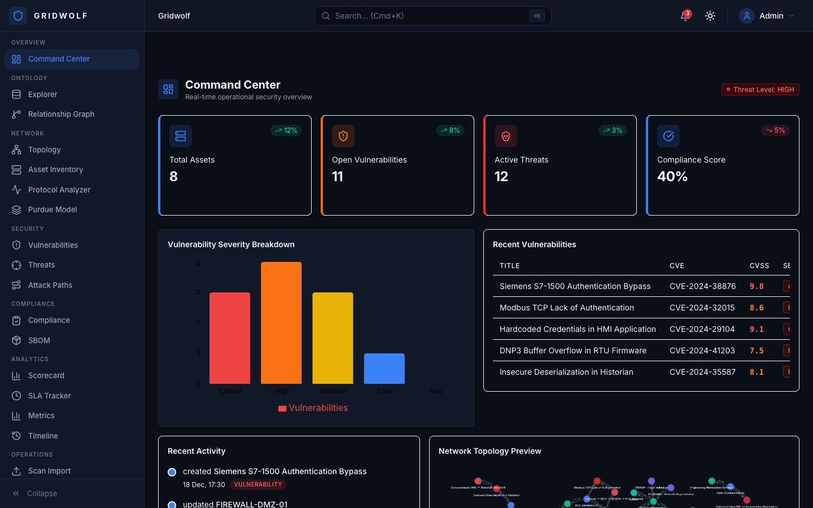
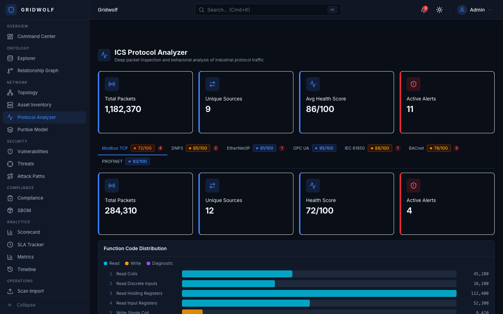
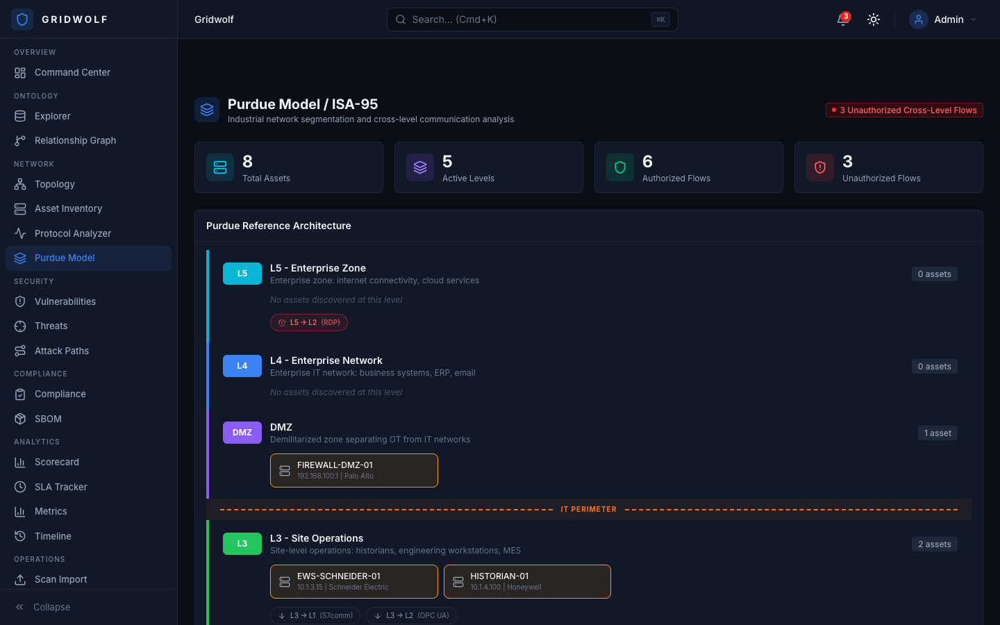
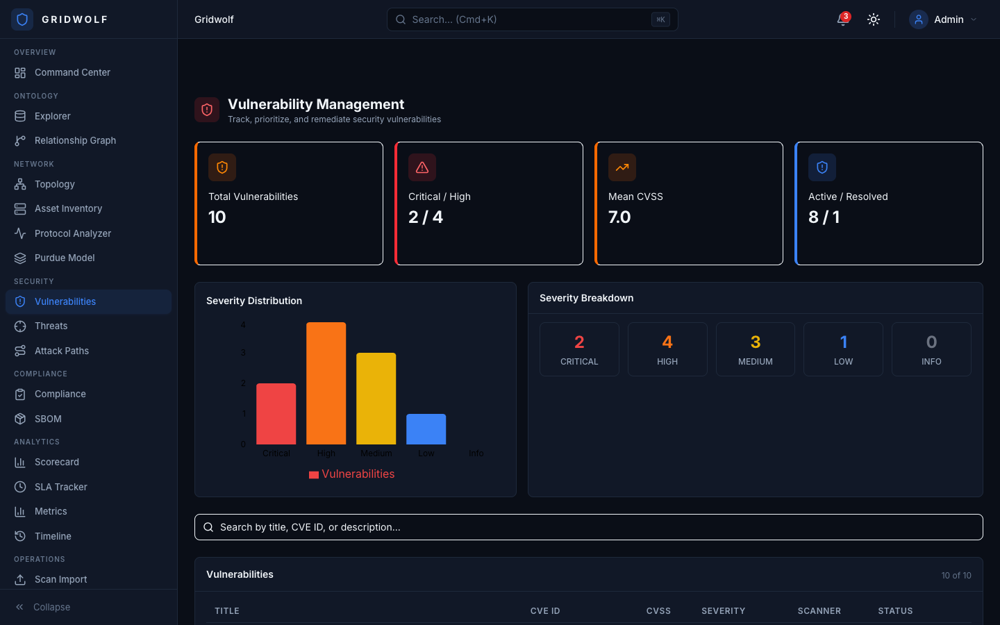
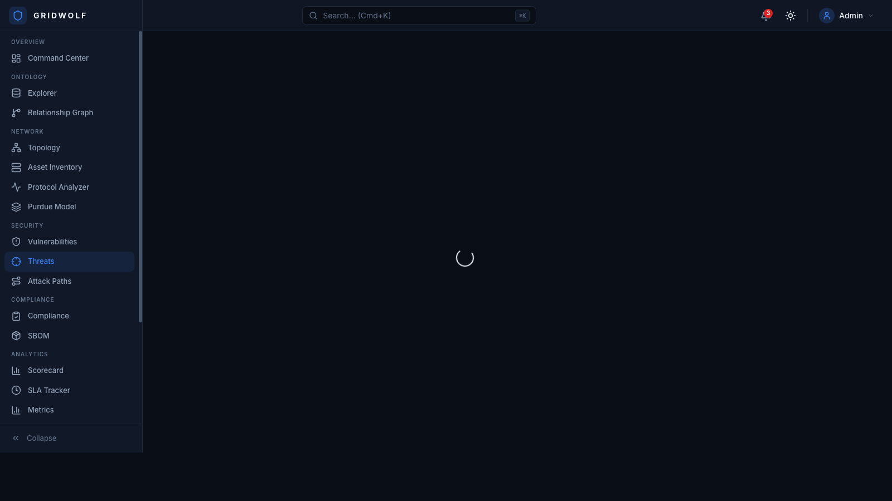

<p align="center">
  
</p>

<h1 align="center">Gridwolf</h1>

<p align="center">
  <strong>Open-source unified security operations & threat intelligence platform for OT/ICS environments</strong>
</p>

<p align="center">
  <a href="https://valinorintelligence.github.io/Gridwolf/"><strong>🔴 Live Demo</strong></a> •
  <a href="#features">Features</a> •
  <a href="#screenshots">Screenshots</a> •
  <a href="#quick-start">Quick Start</a> •
  <a href="#air-gap-deployment">Air-Gap Deployment</a> •
  <a href="#architecture">Architecture</a> •
  <a href="#tech-stack">Tech Stack</a> •
  <a href="#license">License</a>
</p>

---

## Overview

Gridwolf combines **OT/ICS network security** with **Application Security Posture Management (ASPM)** through an **ontology-driven data model** where every entity — hosts, vulnerabilities, network flows, protocols, compliance controls — is an interconnected object you can explore, link, and act on.

Built for **operational technology (OT) engineers** and **security operations teams** managing industrial control systems, SCADA networks, and critical infrastructure. Designed to run in **fully air-gapped environments** with zero internet dependency.

## Features

### 🎯 Command Center
Real-time operational security dashboard with severity breakdown, vulnerability trends, network topology preview, and threat level indicators.

### 🔬 Ontology Explorer
Ontology-driven object explorer where every entity is a typed object with properties, links, and actions. 10 pre-defined object types: Host, Vulnerability, NetworkFlow, Protocol, Product, Scanner, AttackPath, ComplianceControl, Component, Identity.

### 🌐 Network Topology
ICS/SCADA network visualization with Purdue Model level grouping, protocol-aware connections, and cross-level communication analysis.

### 📡 ICS Protocol Analyzer
Deep packet inspection for 7 industrial protocols:
- **Modbus TCP** — Function code distribution, register maps, anomaly detection
- **DNP3** — Point monitoring, unsolicited responses, authentication analysis
- **EtherNet/IP** — CIP service tracking, I/O connections, implicit messaging
- **OPC UA** — Node browsing, session monitoring, certificate validation
- **IEC 61850** — GOOSE/MMS analysis, report control blocks
- **BACnet** — Object discovery, COV subscriptions, router analysis
- **PROFINET** — Real-time class analysis, alarm monitoring, DCP tracking

### 🏗️ Purdue Model / ISA-95
Interactive visualization of the Purdue Reference Architecture (L0-L5 + DMZ):
- Assets placed at correct Purdue levels with security status
- Cross-level communication flow analysis
- **Unauthorized flow detection** — Alerts when L0 talks directly to L4
- IT/OT security boundary visualization

### 🛡️ Vulnerability Management
Track, prioritize, and remediate security vulnerabilities with:
- CVE correlation with ICS-CERT advisories
- CVSS scoring with severity breakdown
- Mean CVSS calculation across your environment
- Scanner integration (Nessus, Semgrep, Trivy, SARIF)

### ⚔️ MITRE ATT&CK for ICS
Threat intelligence mapping against the MITRE ATT&CK for ICS framework:
- 11 tactic columns with technique cards
- Threat severity distribution
- Active attack path correlation

### 🗺️ Attack Path Analysis
Visualize lateral movement chains through your OT network:
- Step-by-step attack chain visualization
- Risk score calculation
- Exploited vulnerability correlation
- Target asset identification

### ✅ Compliance Management
Multi-framework compliance tracking:
- IEC 62443, NIST 800-82, OWASP, PCI-DSS, NERC CIP
- Per-framework pass rates
- Control-level status (pass/fail/partial)
- Compliance score trending

### 📦 SBOM Analysis
Software Bill of Materials management:
- Component inventory with ecosystem/license tracking
- Dependency tree visualization
- Vulnerable component identification

### 📊 Additional Dashboards
- **Security Scorecard** — Aggregate risk score with category breakdowns
- **SLA Tracker** — MTTR/MTTD monitoring with breach detection
- **Metrics & Analytics** — Trend analysis for vulns, scans, remediation velocity
- **Timeline** — Chronological event feed with filtering
- **Scan Import** — Drag-and-drop for Semgrep, Trivy, SARIF, Nessus, Nuclei, Grype
- **Integrations** — 12 SIEM/SOAR connectors (Jira, Slack, Splunk, ServiceNow, etc.)
- **Workshop** — Custom dashboard builder
- **AI Copilot** — Conversational security assistant

### 🔒 Air-Gap Deployment
Purpose-built for disconnected OT environments:
- Single tarball deployment via USB drive
- SHA256 integrity verification
- Auto-generated cryptographic secrets
- No external network dependencies
- localhost-only binding by default
- Resource limits for industrial PCs

## Screenshots

### Command Center


### ICS Protocol Analyzer


### Purdue Model / ISA-95


### Vulnerability Management


### MITRE ATT&CK for ICS


## Architecture

```
┌──────────────────────────────────────────────────────────┐
│                      Gridwolf UI                          │
│  ┌───────────┐ ┌──────────┐ ┌──────────┐ ┌───────────┐  │
│  │ Ontology   │ │ Protocol │ │ Purdue   │ │ Attack    │  │
│  │ Explorer   │ │ Analyzer │ │ Model    │ │ Paths     │  │
│  ├───────────┤ ├──────────┤ ├──────────┤ ├───────────┤  │
│  │ Vuln Mgmt  │ │ Network  │ │Compliance│ │ Workshop  │  │
│  │            │ │ Topology │ │          │ │ Builder   │  │
│  └───────────┘ └──────────┘ └──────────┘ └───────────┘  │
├──────────────────────────────────────────────────────────┤
│               React 18 + TypeScript + Tailwind v4         │
│               Cytoscape.js + Recharts + React Flow        │
├────────────────────────────┬─────────────────────────────┤
│   FastAPI Backend          │     Tauri v2 Desktop         │
│  ┌──────────┐ ┌─────────┐ │  ┌────────────────────┐     │
│  │ Ontology │ │Scanner  │ │  │ PCAP Capture       │     │
│  │ Engine   │ │Parsers  │ │  │ Native File I/O    │     │
│  │ (JSONB)  │ │(SARIF+) │ │  │ Network Interfaces │     │
│  └──────────┘ └─────────┘ │  └────────────────────┘     │
├────────────────────────────┴─────────────────────────────┤
│   PostgreSQL 16  │   Redis 7   │   Celery Workers        │
│   (GIN indexes)  │  (pub/sub)  │  (async scan parsing)   │
└──────────────────────────────────────────────────────────┘
```

### Ontology Data Model

Everything in Gridwolf is an **Object** — built on an ontology-first architecture:

```
ObjectType (schema)
  └─► ObjectInstance (data, JSONB properties)
        ├─► Links (typed relationships to other objects)
        ├─► Actions (operations: create ticket, isolate host, etc.)
        └─► AuditLog (full change history)
```

## Tech Stack

| Layer | Technology |
|-------|-----------|
| **Frontend** | React 18, TypeScript, Vite 6, TailwindCSS 4 |
| **Visualization** | Cytoscape.js (graphs), React Flow (attack paths), Recharts (charts) |
| **State** | Zustand (stores), React Query (data fetching) |
| **Backend** | FastAPI, SQLAlchemy 2.0 (async), Pydantic v2 |
| **Database** | PostgreSQL 16+ with JSONB & GIN indexes |
| **Cache/Queue** | Redis 7+, Celery |
| **Desktop** | Tauri v2 (Rust) |
| **Auth** | JWT with RBAC |
| **CI/CD** | GitHub Actions (lint, build, test) |
| **Deployment** | Docker Compose, Air-gap bundle |

## Quick Start

### Prerequisites

- Node.js 20+
- Python 3.12+
- PostgreSQL 16+ and Redis 7+ (or Docker)

### Web Development

```bash
# Clone the repo
git clone https://github.com/TheSecurityLead/Gridwolf.git
cd Gridwolf

# Start database services
docker compose up postgres redis -d

# Frontend
cd frontend
npm install
npm run dev
# → http://localhost:5173

# Backend (new terminal)
cd backend
pip install -e ".[dev]"
alembic upgrade head
python -m app.seed
uvicorn app.main:app --reload --port 8000
```

### Desktop (Tauri)

```bash
# Prerequisites: Rust toolchain (rustup.rs)
cd src-tauri
cargo tauri dev
```

### Docker Compose (Full Stack)

```bash
docker compose up --build
# Frontend → http://localhost:3000
# Backend  → http://localhost:8000
```

## Air-Gap Deployment

Gridwolf is designed to run in **fully disconnected OT environments**. No internet required.

### Deployment Flow

```
Internet-Connected Machine              USB/Removable Media        Air-Gapped OT Network
┌─────────────────────────┐                                       ┌─────────────────────────┐
│  git clone gridwolf     │                                       │  Industrial PC / Server  │
│  ./build-bundle.sh      │  ──── gridwolf-bundle.tar.gz ────►   │  ./load-and-run.sh       │
│  (builds Docker images) │       + SHA256 checksum               │  (loads images & starts) │
└─────────────────────────┘                                       └─────────────────────────┘
                                                                   ● Binds to localhost only
                                                                   ● No outbound connections
                                                                   ● Runs at Purdue Level 3.5
```

### Build the Bundle (on internet-connected machine)

```bash
cd deploy/airgap
./build-bundle.sh --tag v1.0.0
# Creates: gridwolf-airgap-v1.0.0.tar.gz + checksum file
```

### Deploy (on air-gapped host)

```bash
# Transfer tarball via USB to the target machine
./load-and-run.sh gridwolf-airgap-v1.0.0.tar.gz
# Auto-generates secrets, loads images, runs migrations, starts services
```

### Update

```bash
./update-bundle.sh gridwolf-airgap-v1.1.0.tar.gz
# Backs up database, loads new images, runs migrations, restarts
```

See [deploy/airgap/README.md](deploy/airgap/README.md) for the complete air-gap deployment guide including network segmentation recommendations.

## Project Structure

```
Gridwolf/
├── frontend/                  # React + TypeScript + Vite
│   ├── src/
│   │   ├── components/
│   │   │   ├── ui/            # 10 base UI components (Button, Card, Table, etc.)
│   │   │   ├── ontology/      # 8 ontology-driven components
│   │   │   ├── dashboard/     # 6 widget components
│   │   │   ├── navigation/    # Sidebar, TopBar, CommandPalette
│   │   │   ├── shared/        # ThemeToggle, SearchBar, Badges
│   │   │   └── ot/            # OT-specific (AssetFingerprint, PcapImport)
│   │   ├── pages/             # 23 page components
│   │   ├── stores/            # Zustand stores (auth, theme, ontology, dashboard)
│   │   ├── services/          # API service layer
│   │   ├── hooks/             # React Query hooks + WebSocket
│   │   ├── types/             # TypeScript type definitions
│   │   ├── data/              # Mock data (51 objects, 32 links)
│   │   └── lib/               # Utilities (cn, constants)
│   └── public/
├── backend/                   # FastAPI + SQLAlchemy
│   ├── app/
│   │   ├── api/v1/            # REST endpoints
│   │   ├── models/            # SQLAlchemy models (ontology, user)
│   │   ├── schemas/           # Pydantic schemas
│   │   ├── services/          # Business logic + scanner parsers
│   │   └── core/              # Config, DB, security
│   └── alembic/               # Database migrations
├── src-tauri/                 # Tauri v2 desktop wrapper
├── deploy/
│   └── airgap/                # Air-gap deployment scripts
├── docker-compose.yml         # Full-stack development
├── .github/workflows/         # CI pipeline
└── docs/screenshots/          # Application screenshots
```

## Ontology Object Types

| Type | Icon | Description |
|------|------|-------------|
| **Host** | 🖥️ | Network devices, PLCs, RTUs, HMIs, engineering workstations |
| **Vulnerability** | 🛡️ | CVEs, misconfigurations, firmware issues |
| **NetworkFlow** | 🔀 | Packet captures, session data, protocol analysis |
| **Protocol** | 📡 | ICS protocols (Modbus, DNP3, EtherNet/IP, OPC UA, etc.) |
| **Product** | 📦 | Software products and firmware versions |
| **Scanner** | 🔍 | Security scanning tools and their configurations |
| **AttackPath** | ⚔️ | Lateral movement chains through the network |
| **ComplianceControl** | ✅ | Regulatory framework controls (IEC 62443, NIST, etc.) |
| **Component** | 🧩 | Software components / SBOM entries |
| **Identity** | 👤 | User accounts and service identities |

## Contributing

1. Fork the repository
2. Create your feature branch (`git checkout -b feature/amazing-feature`)
3. Commit your changes (`git commit -m 'Add amazing feature'`)
4. Push to the branch (`git push origin feature/amazing-feature`)
5. Open a Pull Request

## License

MIT License — see [LICENSE](LICENSE) for details.

---

<p align="center">
  <strong>Gridwolf</strong> — Securing industrial infrastructure, one object at a time.
</p>
