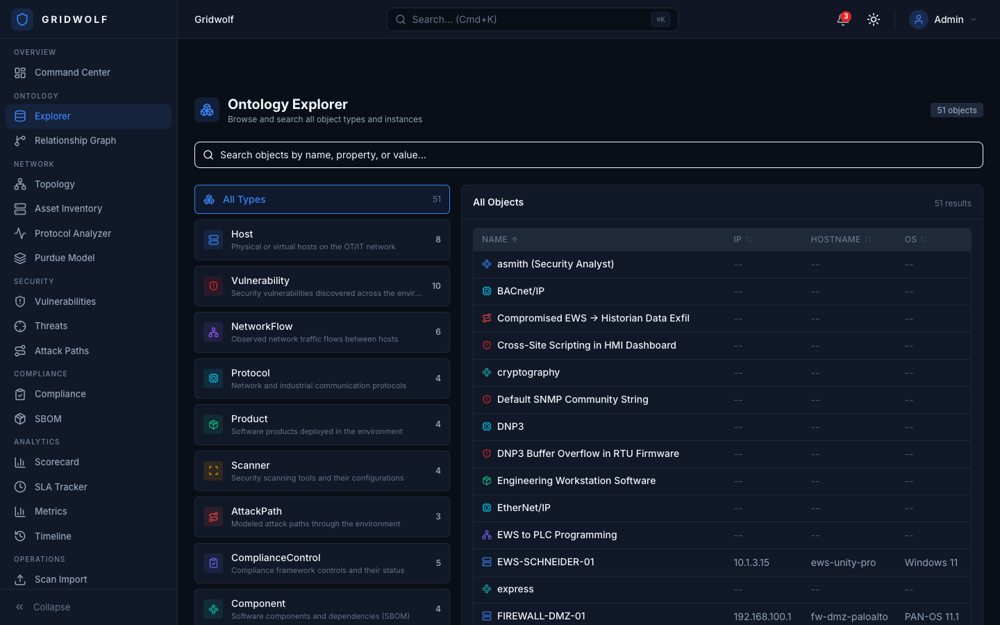
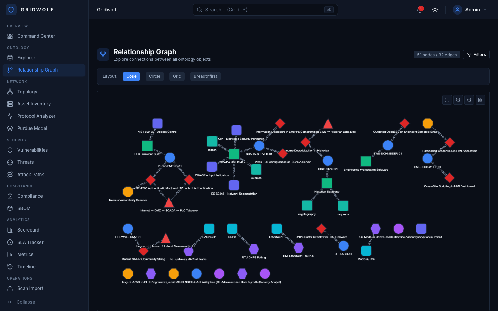
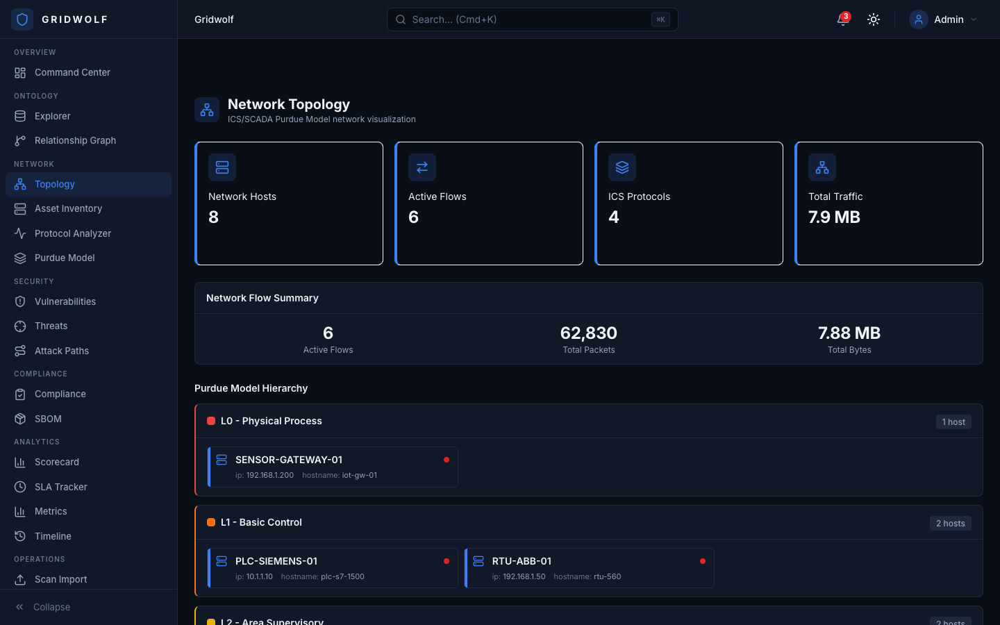
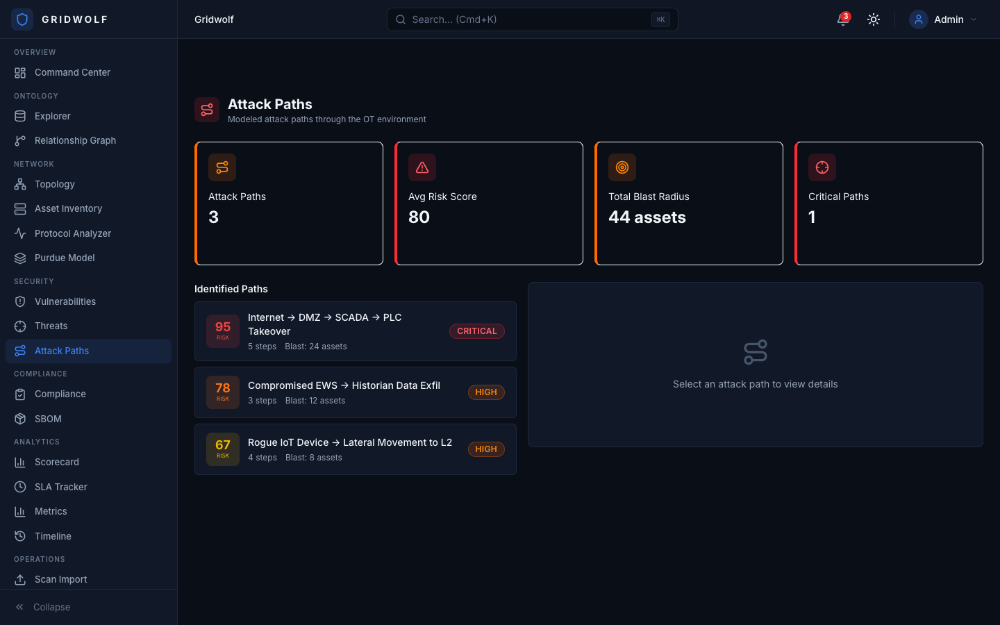
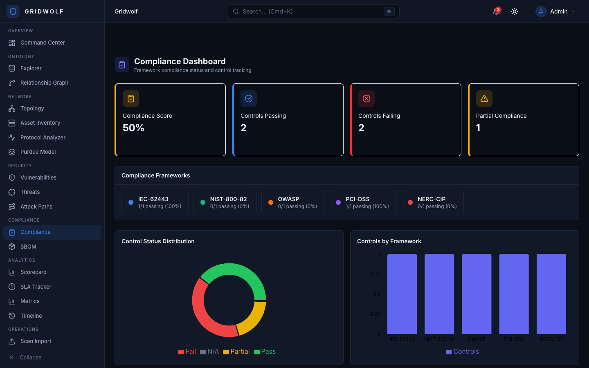
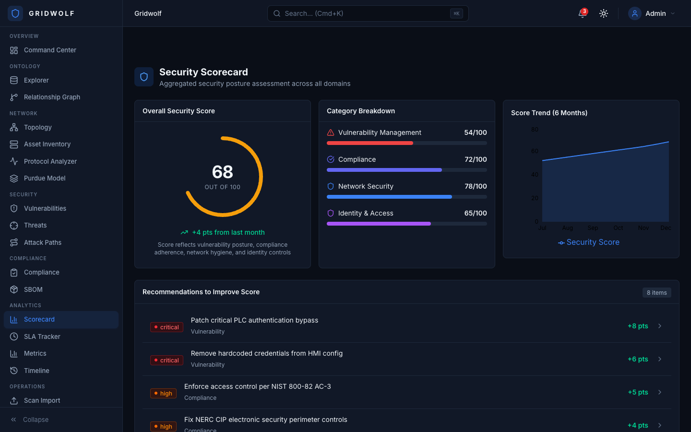
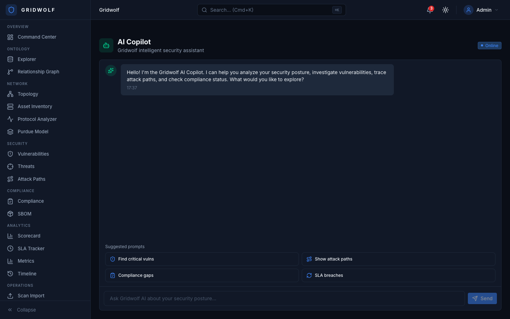

<p align="center">
  
</p>

<h1 align="center">Gridwolf</h1>

<p align="center">
  <strong>Open-source passive ICS/SCADA network discovery and topology visualization tool</strong><br />
  <em>A modern successor to NSA's GRASSMARLIN — built for OT security assessments</em>
</p>

<p align="center">
  <a href="https://gridwolf.vercel.app"><strong>Live Demo</strong></a> &middot;
  <a href="#features">Features</a> &middot;
  <a href="#screenshots">Screenshots</a> &middot;
  <a href="#quick-start">Quick Start</a> &middot;
  <a href="#air-gap-deployment">Air-Gap Deployment</a> &middot;
  <a href="#architecture">Architecture</a> &middot;
  <a href="#tech-stack">Tech Stack</a> &middot;
  <a href="#license">License</a>
</p>

<p align="center">
  
  
  
  
</p>

---

## Why Gridwolf?

Active network scanning in operational technology environments can crash PLCs, trip safety systems, and halt production lines. GRASSMARLIN solved this with passive analysis, but NSA archived the project in 2023, leaving it with an aging Java UI and no active maintenance.

**Gridwolf picks up where GRASSMARLIN left off** with a modern stack, deeper protocol support, and security analysis capabilities purpose-built for ICS/SCADA assessments:

- **Zero packets generated** — analyzes existing PCAP captures only; safe for any OT environment
- **19+ industrial protocols** — from Modbus and DNP3 to PROFINET DCP and IEC 60870-5-104
- **ICS threat detection** — MITRE ATT&CK for ICS mapping, known malware signatures, CVE correlation
- **Multiple topology views** — Purdue-layered logical view, switch-level physical view, connection matrix, timeline scrubber
- **Air-gap native** — single-binary desktop app via Tauri v2 or containerized web deployment, no internet required
- **Modern DX** — React + TypeScript + Rust, not a Java Swing application from 2015

---

## Features

### Network Discovery

Import one or many PCAP files and Gridwolf extracts every device, connection, and protocol conversation automatically.

- Multi-PCAP import with merge and deduplication
- 19+ protocol dissectors covering ICS, building automation, and infrastructure protocols
- Bidirectional connection tracking with session reconstruction
- Automatic subnet and VLAN detection
- Passive OS and firmware fingerprinting from protocol metadata

### Topology Visualization

Four complementary views to understand your OT network from every angle.

| View | Description |
|------|-------------|
| **Logical (Purdue)** | Devices arranged by ISA-95 / Purdue Model levels (L0 through L5 + DMZ) with cross-level flow analysis |
| **Physical** | Switch-port topology reconstructed from LLDP, CDP, and spanning tree data |
| **Mesh** | Connection matrix showing all device-to-device communication pairs with protocol breakdown |
| **Timeline** | Temporal scrubber to replay network activity and observe communication patterns over time |

Interactive graph powered by Cytoscape.js with pan, zoom, filtering, grouping, and layout algorithms optimized for industrial network structures.

### Deep Protocol Analysis

Full-depth dissection of industrial control system protocols, not just port identification.

| Protocol | Analysis Capabilities |
|----------|----------------------|
| **Modbus TCP/RTU** | Function code distribution, register read/write maps, exception tracking, anomaly detection |
| **DNP3** | Object/variation parsing, unsolicited response monitoring, secure authentication analysis |
| **EtherNet/IP + CIP** | Service tracking, I/O connection monitoring, implicit messaging, identity extraction |
| **S7comm / S7comm+** | Block access monitoring, PLC program transfer detection, CPU state changes |
| **BACnet** | Object discovery, COV subscriptions, router analysis, BBMD mapping |
| **IEC 60870-5-104** | ASDU type parsing, interrogation commands, clock synchronization tracking |
| **PROFINET DCP** | Device identification, name assignment detection, real-time class analysis |
| **OPC UA** | Session monitoring, node browsing, certificate validation, security policy analysis |
| **IEC 61850** | GOOSE message analysis, MMS traffic inspection, report control block monitoring |
| **LLDP / CDP** | Switch topology reconstruction, neighbor discovery, VLAN assignment |
| **SNMP** | Community string extraction, MIB walk detection, device inventory enrichment |
| **ARP / DHCP / DNS** | Network infrastructure mapping, address resolution tracking |
| **HTTP / HTTPS** | Web HMI identification, firmware update detection, REST API discovery |
| **Ring Redundancy** | MRP/HRP ring topology detection and fault analysis |

### Device Identification

Go beyond IP addresses to understand what each device actually is.

- **MAC OUI lookup** — Resolve manufacturer from MAC address against IEEE OUI database (offline)
- **Protocol-specific vendor ID** — Extract vendor, model, and firmware from protocol responses (Modbus Device ID, EtherNet/IP Identity, BACnet I-Am, PROFINET DCP)
- **Confidence scoring** — Five-level confidence rating (Confirmed, High, Medium, Low, Unknown) based on evidence quality
- **Infrastructure classification** — Automatically categorize devices as PLC, RTU, HMI, Engineering Workstation, Historian, Switch, Router, Firewall, or Unknown
- **Purdue level assignment** — Place devices at the correct ISA-95 level based on protocol behavior and communication patterns

### Security Analysis

Passive discovery is only the first step. Gridwolf layers security intelligence on top of the network map.

- **MITRE ATT&CK for ICS** — 40+ detection rules mapped to ICS-specific tactics and techniques across 11 tactic categories
- **ICS malware detection** — Signature-based detection for known ICS malware families including FrostyGoop, PIPEDREAM/INCONTROLLER, Industroyer2, TRITON/TRISIS, BlackEnergy, and CrashOverride
- **CVE matching** — Correlate discovered devices and firmware versions against known ICS vulnerabilities from NVD and ICS-CERT advisories
- **Purdue Model enforcement** — Alert on unauthorized cross-level communications (e.g., L0 device communicating directly with L4 enterprise network)
- **Compliance mapping** — Map findings to IEC 62443 zones and conduits, NIST SP 800-82 controls, and NERC CIP requirements
- **Attack path analysis** — Visualize potential lateral movement chains through the OT network based on discovered connectivity

### External Tool Integration

Gridwolf does not replace your existing tools. It integrates with them.

| Tool | Integration |
|------|-------------|
| **Zeek** | Import Zeek connection logs and protocol-specific logs as supplemental data sources |
| **Suricata** | Import Suricata EVE JSON alerts and correlate with discovered network topology |
| **Nmap / Masscan** | Import scan results (XML) to enrich passively discovered devices with active scan data |
| **Wazuh** | Ingest host-based alerts to correlate endpoint activity with network observations |
| **Siemens SINEMA / TIA Portal** | Import project files for device inventory cross-reference |
| **Wireshark** | Export filtered PCAPs for deep-dive analysis in Wireshark |

### Reporting and Export

Generate deliverables directly from Gridwolf without manual data wrangling.

- **PDF assessment reports** — Executive summary, device inventory, topology diagrams, findings, and recommendations
- **CSV / JSON export** — Full device inventory, connection table, and findings in machine-readable formats
- **SBOM generation** — Software Bill of Materials for discovered firmware and software components
- **STIX 2.1 export** — Share threat intelligence observations in structured format
- **Filtered PCAP export** — Extract protocol-specific or device-specific traffic into new PCAP files
- **Communication allowlist** — Generate baseline allowlists with automatic firewall rule generation (iptables, Cisco ACL, Palo Alto)

### Session Management

Assessments span days. Gridwolf keeps your work organized.

- **SQLite persistence** — All session data stored locally in a single SQLite database; no external database required for desktop use
- **.gwf project archives** — Save and restore complete assessment sessions as portable archive files
- **Baseline drift detection** — Compare current capture against a saved baseline to identify new devices, connections, or protocol changes
- **Project / engagement management** — Organize multiple assessments by client, site, or engagement with tagging and search

---

## Screenshots

### Command Center


### ICS Protocol Analyzer


### Purdue Model / ISA-95


### Vulnerability Management


### MITRE ATT&CK for ICS


### Ontology Explorer


### Relationship Graph


### Network Topology


### Attack Path Analysis


### Compliance Dashboard


### Security Scorecard


### AI Copilot


---

## Architecture

```
┌────────────────────────────────────────────────────────────────────┐
│                         Gridwolf UI                                │
│                                                                    │
│  ┌─────────────┐ ┌──────────────┐ ┌────────────┐ ┌─────────────┐ │
│  │  Topology    │ │  Protocol    │ │  Purdue    │ │  Security   │ │
│  │  Views       │ │  Analyzer    │ │  Model     │ │  Analysis   │ │
│  ├─────────────┤ ├──────────────┤ ├────────────┤ ├─────────────┤ │
│  │  Device      │ │  Connection  │ │ Compliance │ │  Reporting  │ │
│  │  Inventory   │ │  Matrix      │ │ Dashboard  │ │  & Export   │ │
│  └─────────────┘ └──────────────┘ └────────────┘ └─────────────┘ │
├────────────────────────────────────────────────────────────────────┤
│            React 18 + TypeScript + Vite 6 + Tailwind v4           │
│            Cytoscape.js + Recharts + React Flow                   │
├──────────────────────────────┬─────────────────────────────────────┤
│   Analysis Engine            │     Tauri v2 Desktop Shell          │
│  ┌────────────┐ ┌──────────┐│  ┌───────────────────────────────┐  │
│  │ PCAP       │ │Protocol  ││  │ Native PCAP import            │  │
│  │ Parser     │ │Dissectors││  │ File system access             │  │
│  │            │ │(19+)     ││  │ SQLite session storage         │  │
│  ├────────────┤ ├──────────┤│  │ OS-level network interface     │  │
│  │ Device     │ │Security  ││  │ Single-binary distribution     │  │
│  │ Classifier │ │Rules     ││  └───────────────────────────────┘  │
│  │ (OUI + ID) │ │(ATT&CK) ││                                     │
│  └────────────┘ └──────────┘│                                     │
├──────────────────────────────┴─────────────────────────────────────┤
│   SQLite (session storage)  │  Rust backend (Tauri commands)       │
│   .gwf archives (portable)  │  PCAP parsing (libpcap / etherparse)│
└────────────────────────────────────────────────────────────────────┘
```

### Data Flow

```
  PCAP Files ──►  Protocol     ──►  Device        ──►  Topology    ──►  Security
  (imported)      Dissection        Classification      Generation      Analysis
                  19+ protocols     OUI + vendor ID     4 view types    ATT&CK rules
                  Session recon     Purdue placement    Purdue layers   CVE matching
                  Connection map    Confidence score    Physical links  Compliance map
```

---

## Tech Stack

| Layer | Technology |
|-------|-----------|
| **Frontend** | React 18, TypeScript 5, Vite 6, Tailwind CSS 4 |
| **Visualization** | Cytoscape.js (topology graphs), React Flow (attack paths), Recharts (charts & metrics) |
| **State Management** | Zustand (client stores), React Query (async data) |
| **Desktop Runtime** | Tauri v2 (Rust) — single binary, native performance, no Electron overhead |
| **PCAP Parsing** | Rust with etherparse / libpcap bindings |
| **Session Storage** | SQLite (embedded, zero-config) |
| **Reporting** | PDF generation, CSV/JSON/STIX 2.1 export |
| **CI/CD** | GitHub Actions (lint, type-check, build, test) |
| **Deployment** | Tauri desktop installer, Docker Compose (web), Air-gap bundle |

---

## Quick Start

### Prerequisites

- Node.js 20+
- Rust toolchain ([rustup.rs](https://rustup.rs)) for desktop builds

### Web Development (Frontend Only)

```bash
# Clone the repository
git clone https://github.com/valinorintelligence/Gridwolf.git
cd Gridwolf

# Install dependencies and start dev server
cd frontend
npm install
npm run dev
# Open http://localhost:5173
```

The web frontend runs standalone with built-in demo data for development and evaluation.

### Desktop Application (Tauri)

```bash
# Ensure Rust toolchain is installed
curl --proto '=https' --tlsv1.2 -sSf https://sh.rustup.rs | sh

# Clone and build
git clone https://github.com/valinorintelligence/Gridwolf.git
cd Gridwolf

# Install frontend dependencies
cd frontend && npm install && cd ..

# Build and run the desktop app
cd src-tauri
cargo tauri dev
```

### Docker Compose (Web Deployment)

```bash
docker compose up --build
# Gridwolf UI  → http://localhost:3000
# API          → http://localhost:8000
```

---

## Air-Gap Deployment

Gridwolf is purpose-built for **disconnected OT environments** where internet access is not available and not desired. Zero external dependencies at runtime.

### Deployment Flow

```
Internet-Connected Machine              USB / Removable Media        Air-Gapped OT Network
┌─────────────────────────┐                                         ┌──────────────────────────┐
│  git clone gridwolf     │                                         │  Industrial PC / Server   │
│  ./build-bundle.sh      │  ──── gridwolf-bundle.tar.gz ────►     │  ./load-and-run.sh        │
│  (builds all artifacts) │       + SHA256 checksum file            │  (loads images & starts)  │
└─────────────────────────┘                                         └──────────────────────────┘
                                                                     Binds to localhost only
                                                                     No outbound connections
                                                                     Runs at Purdue Level 3.5
```

### Build the Bundle (internet-connected machine)

```bash
cd deploy/airgap
./build-bundle.sh --tag v1.0.0
# Output: gridwolf-airgap-v1.0.0.tar.gz + gridwolf-airgap-v1.0.0.sha256
```

### Deploy (air-gapped target)

```bash
# Transfer tarball via USB to the target machine
# Verify integrity
sha256sum -c gridwolf-airgap-v1.0.0.sha256

# Deploy
./load-and-run.sh gridwolf-airgap-v1.0.0.tar.gz
# Auto-generates cryptographic secrets
# Loads container images from archive
# Binds to 127.0.0.1 only
# Applies resource limits for industrial PCs
```

### Update an Existing Deployment

```bash
./update-bundle.sh gridwolf-airgap-v1.1.0.tar.gz
# Backs up session database
# Loads new images
# Restarts services with zero data loss
```

### Desktop Alternative

For the simplest air-gap deployment, use the Tauri desktop build. Copy the single platform-specific binary to the target machine via USB. No containers, no services, no configuration.

See [deploy/airgap/README.md](deploy/airgap/README.md) for the complete air-gap deployment guide including network segmentation recommendations.

---

## Project Structure

```
Gridwolf/
├── frontend/                    # React + TypeScript + Vite
│   ├── src/
│   │   ├── components/
│   │   │   ├── ui/              # Base UI components (Button, Card, Table, etc.)
│   │   │   ├── topology/        # Network topology visualization components
│   │   │   ├── protocol/        # Protocol analysis views
│   │   │   ├── dashboard/       # Dashboard widget components
│   │   │   ├── navigation/      # Sidebar, TopBar, CommandPalette
│   │   │   ├── shared/          # ThemeToggle, SearchBar, Badges
│   │   │   └── ot/              # OT-specific (AssetFingerprint, PcapImport)
│   │   ├── pages/               # Page components (topology, protocols, devices, etc.)
│   │   ├── stores/              # Zustand stores (session, theme, topology, devices)
│   │   ├── services/            # Analysis engine and API layer
│   │   ├── hooks/               # Custom React hooks
│   │   ├── types/               # TypeScript type definitions
│   │   ├── data/                # Demo data for development and evaluation
│   │   └── lib/                 # Utilities and constants
│   └── public/
├── src-tauri/                   # Tauri v2 desktop shell (Rust)
│   ├── src/
│   │   ├── pcap/                # PCAP parsing and protocol dissection
│   │   ├── analysis/            # Device classification and security rules
│   │   ├── export/              # Report generation and data export
│   │   └── commands/            # Tauri IPC command handlers
│   └── Cargo.toml
├── deploy/
│   └── airgap/                  # Air-gap deployment scripts and documentation
├── docker-compose.yml           # Web deployment stack
├── .github/workflows/           # CI pipeline
└── docs/
    └── screenshots/             # Application screenshots
```

---

## Comparison with GRASSMARLIN

| Capability | GRASSMARLIN | Gridwolf |
|-----------|-------------|----------|
| **Status** | Archived (2023) | Actively maintained |
| **UI Framework** | Java Swing | React + TypeScript |
| **Desktop Runtime** | JVM | Tauri v2 (Rust) — smaller binary, lower memory |
| **Protocol Count** | ~8 | 19+ |
| **Topology Views** | 1 (logical) | 4 (logical, physical, mesh, timeline) |
| **Security Analysis** | None | ATT&CK for ICS, malware detection, CVE matching |
| **Compliance** | None | IEC 62443, NIST 800-82, NERC CIP |
| **Export Formats** | Image, CSV | PDF, CSV, JSON, STIX 2.1, PCAP, SBOM, firewall rules |
| **Session Persistence** | In-memory | SQLite + .gwf portable archives |
| **Air-Gap Deployment** | Manual | Scripted bundle with integrity verification |
| **Cross-Platform** | Windows (primary) | Windows, macOS, Linux (web + desktop) |

---

## Use Cases

- **OT Security Assessments** — Import PCAPs from a network tap or SPAN port and generate a complete device inventory, topology map, and security findings report without touching the network
- **ICS Incident Response** — Analyze captured traffic to identify compromised devices, lateral movement, and malware communication patterns
- **Compliance Audits** — Map discovered network architecture against IEC 62443 zone/conduit requirements, NIST 800-82, or NERC CIP
- **Network Baseline** — Establish a known-good communication baseline and detect drift over time as devices are added or configurations change
- **Brownfield Discovery** — Map undocumented legacy OT networks where no accurate inventory exists
- **Red Team / Pentest** — Passively enumerate OT networks during authorized assessments without risking disruption to operations

---

## Contributing

Contributions are welcome. Gridwolf is an open-source project and benefits from community involvement.

1. Fork the repository
2. Create a feature branch (`git checkout -b feature/modbus-deep-inspection`)
3. Commit your changes (`git commit -m 'Add Modbus register map visualization'`)
4. Push to the branch (`git push origin feature/modbus-deep-inspection`)
5. Open a Pull Request

Areas where contributions are especially valuable:
- Additional protocol dissectors
- ICS malware signature rules
- Device fingerprint database expansion
- Topology layout algorithm improvements
- Documentation and deployment guides

---

## License

MIT License — see [LICENSE](LICENSE) for details.

---

<p align="center">
  <strong>Gridwolf</strong> — Passive ICS network discovery for environments where active scanning is not an option.
</p>
